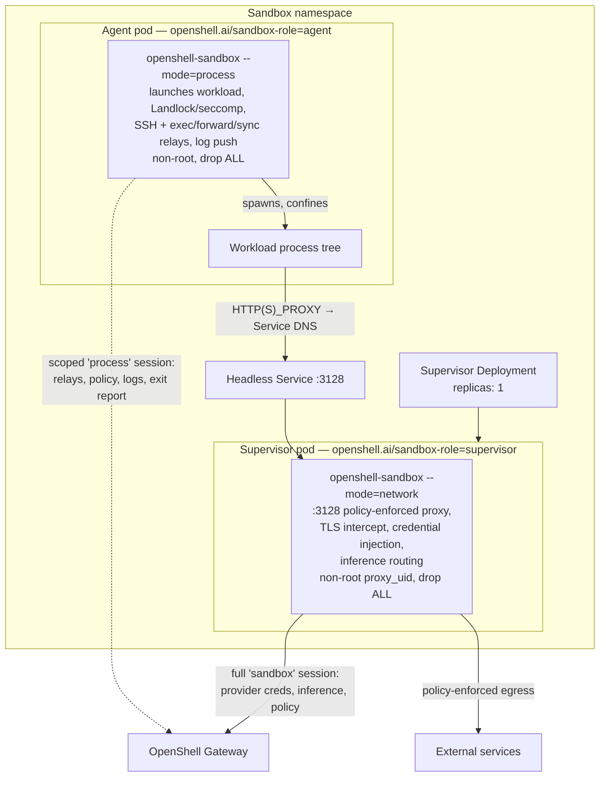
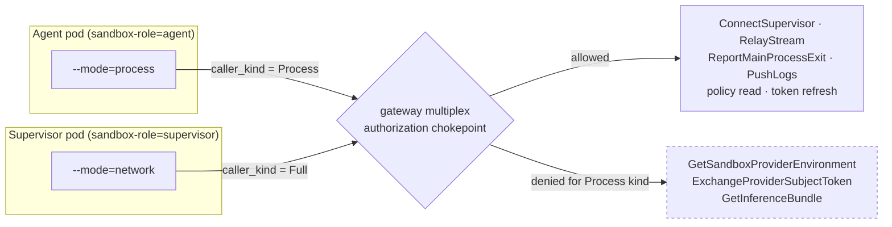
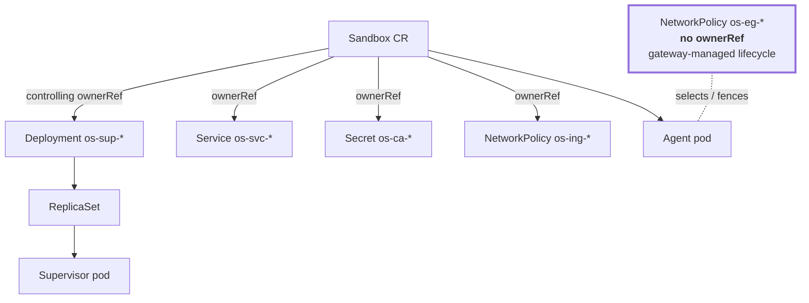
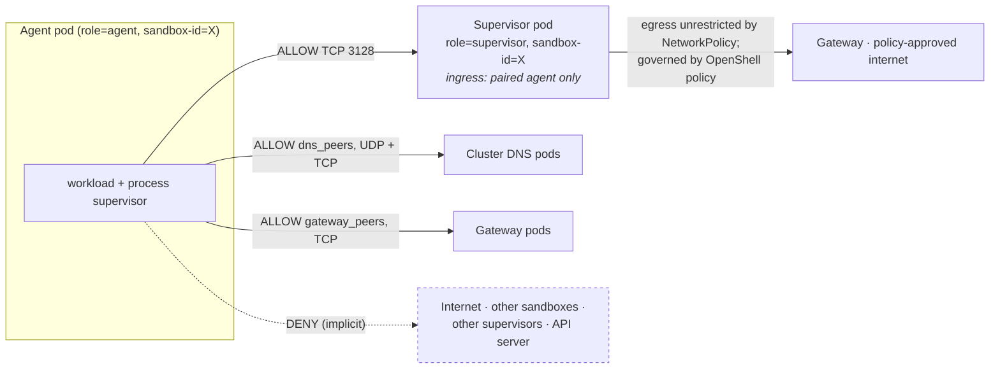
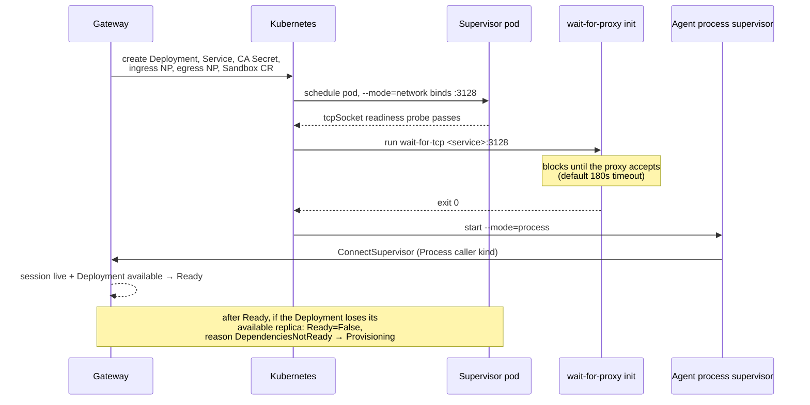

---
authors:
  - "@TaylorMutch"
  - "@russellb"
state: draft
links:
  - https://github.com/NVIDIA/OpenShell/pull/2077 - original proxy-pod topology PR from TaylorMutch
  - https://github.com/NVIDIA/OpenShell/pull/2074 - kubernetes combined topology
  - https://github.com/NVIDIA/OpenShell/pull/2076 - kubernetes sidecar topology
  - https://github.com/NVIDIA/OpenShell/pull/2078 - cni-sidecar topology
---

# RFC NNNN - Proxy-Pod Supervisor Topology (and OpenShift Enablement)

<!--
See rfc/README.md for the full RFC process and state definitions. This RFC is
intentionally unnumbered: a number is assigned by maintainers from the
originating issue before it moves out of draft.
-->

## Summary

`proxy-pod` is a Kubernetes supervisor topology that moves the **network proxy**
out of the sandbox pod into a paired, per-sandbox supervisor `Deployment`, while
**keeping the process supervisor in the sandbox pod**. The sandbox pod runs
`openshell-sandbox --mode=process` as the agent container's entrypoint, so it
launches the workload and keeps serving SSH, `connect`, `exec`, upload/download,
file sync, Landlock/seccomp child confinement, and workload log capture. Only the
credential-bearing L4/L7 network proxy lives in the separate pod. Two things are
given up relative to `sidecar`: per-binary matching on network rules, and
provider environment variables injected into the workload — both direct
consequences of moving the network half out of the pod.

Egress is confined by two per-sandbox Kubernetes `NetworkPolicy` objects rather
than by pod-local nftables rules, so the sandbox pod needs **no
`NET_ADMIN`/`SYS_ADMIN`, no privileged init container, and no shared node
component**. Every container in both pods runs non-root with
`capabilities.drop: [ALL]` and `allowPrivilegeEscalation: false` — there is no
privileged mode and no privilege knob to turn.

Compared with the in-pod `sidecar`/`cni-sidecar` topologies, this delivers
substantially the same interactive feature set with the network half in its own
pod — its own failure domain, its own Kata VM, and provider credentials never
co-resident with the workload — and confinement by `NetworkPolicy` instead of
nftables. The cost is that the sandbox pod again holds a gateway credential; that
credential is **scoped** (a `process` caller kind that cannot read provider
secrets, mint upstream credentials, or fetch inference bundles) so the sensitive
capabilities stay only in the proxy pod.

The OpenShift enablement is validated against a live OpenShift 4.22.6 /
OVN-Kubernetes cluster: configurable DNS egress peers (the hardcoded upstream
`kube-system`/port-53 selectors do not hold on OpenShift), and a gated
`nonroot-v2` grant rather than a custom SCC.

> **Revision note.** An earlier revision of this RFC moved the *entire*
> supervisor into the separate pod, leaving the sandbox pod with no supervisor at
> all. That maximized isolation but gave up SSH/exec/sync, filesystem and process
> policy, workload log capture, and provider injection — too much for most users.
> This revision keeps those by leaving the process supervisor in the sandbox pod
> and moving only the network proxy out. The OpenShift enablement, the
> `NetworkPolicy` fence, the companion object set, and the readiness/lifecycle
> machinery all carry forward from that work. See
> [Appendix A](#appendix-a-superseded-network-only-design) for what was dropped
> and why.

## Motivation

OpenShell's `combined` topology runs the full supervisor inside the agent
container, which requires that container to carry `SYS_ADMIN`, `NET_ADMIN`,
`SYS_PTRACE`, and `SYSLOG`. The `sidecar` topology moves network enforcement to
a dedicated sidecar and drops the agent container to no added capabilities, but
still needs a **privileged network init container** in every sandbox pod to
install the nftables fence. [`cni-sidecar`](./cni-sidecar-topology-DRAFT.md)
removes that init container by pushing rule installation to a node-level CNI
plugin, but it moves the privilege rather than eliminating it: the CNI DaemonSet
runs `privileged` with host-path writes, and the binary-aware sidecar still runs
as UID 0 with `SYS_PTRACE` and `DAC_READ_SEARCH`.

All three share an assumption: OpenShell's enforcement point lives inside the
sandbox pod, so the pod must be granted whatever privilege that enforcement
requires. Some clusters will not accept that at any level. Multi-tenant
platforms, regulated environments, and clusters with strict admission policy
often permit only the baseline restricted profile for tenant workloads — no
added capabilities, no root containers, no privileged init containers, no
host-path DaemonSets installed on their behalf. On those clusters OpenShell is
currently not deployable at all.

Such clusters do, however, almost always enforce `NetworkPolicy`, because that
is the tenant-isolation primitive their platform is already built on. If
OpenShell expresses its egress fence as `NetworkPolicy` instead of nftables, the
enforcement moves to machinery the cluster already runs and already trusts, and
the sandbox pod needs no network privilege whatsoever.

The features that depend on the supervisor sharing the workload's namespaces —
process launch, Landlock confinement, and the interactive session paths — do
**not** have to be given up to get there. They require the *process* supervisor
to share those namespaces; they do not require the *network* proxy to. So this
topology keeps the process supervisor in the sandbox pod, exactly where `sidecar`
keeps it, and moves only the network proxy out. The result runs on clusters that
permit no in-pod privilege at all while still delivering the interactive
contract.

OpenShift is the concrete case driving this now. OpenShell's current OpenShift
guidance requires granting sandbox pods the `privileged` SCC and is documented
as experimental and evaluation-only. `cni-sidecar` improves on that but still
needs a custom SCC carrying `SYS_PTRACE` and `DAC_READ_SEARCH` plus
`runAsUser: RunAsAny`. `proxy-pod` needs neither: it admits under the built-in,
unmodified `nonroot-v2` SCC. That makes it the first OpenShell topology that runs
on OpenShift without a bespoke security grant.

## Non-goals

- **Replacing `combined`, `sidecar`, or `cni-sidecar`.** All remain. `combined`
  stays the default and the only topology providing the full supervisor
  contract, including root-mediated filesystem setup and binary-aware network
  policy. `proxy-pod` is for clusters that cannot accept in-pod privilege.
- **Re-implementing supervisor features.** Process launch, Landlock/seccomp
  child confinement, SSH/`connect`, `exec`, upload/download, sync, and log
  capture are *preserved* by keeping the process supervisor in the sandbox pod.
  They reuse the existing `--mode=process` code paths.
- **Provider environment injection into the workload.** This is deliberately
  given up; see [Credential and trust model](#credential-and-trust-model). The
  same scoping that keeps provider secrets out of the agent pod also keeps them
  out of the workload's environment.
- **A zero-supervisor sandbox pod.** Moving the entire supervisor out is
  explicitly not the proposal; see [Appendix A](#appendix-a-superseded-network-only-design).
- **Working without `NetworkPolicy` enforcement.** The topology has no fallback
  fence. On a cluster whose CNI ignores `NetworkPolicy`, the generated policies
  are declarative only and the workload can bypass the proxy freely.
- **DNS-level exfiltration control.** The agent pod is permitted UDP/TCP DNS to
  cluster DNS so name resolution works. DNS tunnelling is not addressed here.
- **Installing or configuring a CNI.** This topology consumes whatever
  `NetworkPolicy` implementation the cluster already runs.
- **Per-sandbox supervisor autoscaling or sharing.** The pairing is strictly
  1:1. A shared proxy serving many sandboxes is a different design.

## Design

### Overview



The single `openshell-sandbox` binary already runs its network and process halves
independently by `--mode`. This is the same split `sidecar` uses, but with the
network half in a **separate pod** and the fence expressed as `NetworkPolicy`.

Crucially, **nothing crosses the pod boundary except workload egress → proxy**:
plain TCP plus a trusted CA. The process supervisor stays whole in the sandbox
pod and owns its relays and gateway session *locally*, so none of `sidecar`'s
cross-container coupling — the peer-credentialed control socket, the abstract SSH
relay bridge, the shared PID namespace, the loopback nftables redirect — is
needed. Those are precisely the parts that would not survive a pod boundary, and
this design never reaches for them.

### What runs where

| | Agent pod (`sandbox-role=agent`) | Supervisor pod (`sandbox-role=supervisor`) |
|---|---|---|
| Process | `openshell-sandbox --mode=process` + workload children | `openshell-sandbox --mode=network` |
| Enforces | Landlock/seccomp child confinement, process lifecycle, workspace layout | L4 endpoint policy, L7/HTTP policy, TLS interception, credential injection, inference routing |
| Relays (SSH/exec/forward/sync) | **served locally** (holds the workload's namespaces) | none |
| Gateway session | scoped `process`-kind session | full `sandbox`-kind session |
| Provider credentials / SPIFFE SVID | **never** (CSI volume, mount, and env are stripped) | yes, isolated here |
| Egress path | gateway directly (its own session); workload children via `HTTP_PROXY` to the paired Service | policy-approved internet |
| Privilege | non-root `sandbox_uid`, `drop: [ALL]`, `allowPrivilegeEscalation: false`, `runAsNonRoot: true` | non-root `proxy_uid`, `drop: [ALL]` |
| Network privilege | **none** — no `NET_ADMIN`, `NET_RAW`, or `SYS_ADMIN`, no netns creation, no nftables | none |

The agent container's entrypoint is replaced with:

```text
<supervisor-mount>/openshell-sandbox --mode=process --workdir /sandbox
```

and the workload command still arrives the normal way, through the sandbox spec
and `openshell sandbox create -- <cmd>`. `containers.agent.command` and
`containers.agent.args` are **rejected at validation in every topology**,
including this one, because the supervisor is always the container entrypoint and
an override would be silently dropped.

### Cross-pod egress transport

The workload's children reach the proxy through injected proxy environment
pointing at the paired headless `Service` on `:3128`, plus the per-sandbox CA
trust bundle:

| Variable | Value |
|---|---|
| `OPENSHELL_PROXY_URL` | `http://<service>.<namespace>.svc:3128` — canonical; the supervisor reconstructs child proxy env from it |
| `ALL_PROXY`, `HTTP_PROXY`, `HTTPS_PROXY`, `http_proxy`, `https_proxy`, `grpc_proxy` | same URL |
| `NO_PROXY`, `no_proxy` | `127.0.0.1,localhost,::1` |
| `NODE_USE_ENV_PROXY` | `1` |
| `NODE_EXTRA_CA_CERTS`, `DENO_CERT` | per-sandbox CA cert |
| `SSL_CERT_FILE`, `REQUESTS_CA_BUNDLE`, `CURL_CA_BUNDLE`, `GIT_SSL_CAINFO` | CA bundle built by the CA init container |

This is advisory; the agent-egress `NetworkPolicy` is the real fence. A
transparent loopback redirect (as `sidecar` does with nftables) is deliberately
**not** used, because it would require `NET_ADMIN` in the sandbox pod — the
privilege this topology exists to avoid. Accordingly the process supervisor skips
its own network-namespace creation (`external_network_enforcement_enabled()`
under `OPENSHELL_NETWORK_ENFORCEMENT_MODE=proxy-pod`) and runs no in-pod proxy.

Two smaller runtime adjustments follow from running non-root in a pod whose
`/run` parent is not writable:

- The SSH relay socket becomes a Linux **abstract** socket
  (`@openshell-proxy-pod-ssh`), which needs no writable directory and is scoped
  to the pod's network namespace.
- The process supervisor prefers `OPENSHELL_PROXY_URL` when deriving the proxy
  URL for relay-spawned children and for SSH-session policy, since there is no
  locally-bound proxy address to discover.

### Credential and trust model

The sandbox pod's process supervisor needs a gateway session for its relays
(`ConnectSupervisor`, `RelayStream`, `ReportMainProcessExit`), log push, policy
read, and token refresh. The sandbox credential is already a gateway-minted,
Ed25519 **per-sandbox** JWT that can only act as its own sandbox — no
cross-sandbox, no cluster-wide, no admin RPC. But its authority was a fixed
allowlist of all `sandbox`-callable RPCs, which includes the three secret-bearing
ones the process supervisor does not need.

This RFC adds a **`caller_kind` claim** to the sandbox JWT (mirroring the
existing `ExtensionJwtClaims.caller_kind`). The driver's `AuthenticateSandbox`
response carries `scoped_process_caller`, set when the calling pod is labeled
`openshell.ai/sandbox-role: agent`; the gateway then mints a `Process`-kind
token for it and a full-authority token for the proxy pod.



Enforcement lives at a **single chokepoint**, `openshell-server`'s `multiplex`
authorization path, against the `PROCESS_CALLER_DENIED_METHODS` list. There are
no additional per-handler guards; the chokepoint is the whole mechanism, which is
why it is the thing to keep covered by tests.

The result: a compromised agent pod can relay into, report on, and renew **its
own** sandbox, but **cannot read provider secrets, mint upstream credentials, or
fetch inference bundles** — those stay exclusively in the proxy pod (a separate
pod, and under a VM `RuntimeClass` a separate VM). It cannot be made literally
read-only, since it must push its own logs, report its own exit, and refresh its
own token, but "own-sandbox, control-plane-minimal, no provider or inference" is
achieved.

For back-compatibility, an absent `caller_kind` claim deserializes to full
authority, so tokens minted before this change keep working across a rolling
gateway upgrade.

Consistent with that, the agent pod does **not** receive the provider SPIFFE
Workload API socket: the driver removes the CSI volume, the container mount, and
`OPENSHELL_PROVIDER_SPIFFE_WORKLOAD_API_SOCKET` from the agent pod entirely, so
it never advertises an SVID path it could not use.

#### Consequence: no provider environment in the workload

The scoping has one user-visible cost that is worth stating plainly rather than
burying. A standalone process supervisor fetches provider environment variables
at startup via `GetSandboxProviderEnvironment` and injects them into the
workload's environment. Under `proxy-pod` that call is denied, so the fetch
degrades gracefully — the sandbox still starts, and the supervisor emits a
`High`-severity `CONFIG:*` fail-closed event — but **the workload receives no
provider environment variables.**

What survives is credential injection at the *proxy* layer: the network
supervisor holds a full-authority session, fetches provider credentials, and
injects them into matching outbound requests during L7 interception. So a
workload that talks to a provider over HTTPS through the proxy is still
authenticated; a workload that expects to read, say, an API key out of its own
environment is not. That is the intended shape — a secret the workload can read
is a secret a compromised workload can exfiltrate — but it is a real behavioral
difference from `combined` and `sidecar`, not a wash.

This is also why `proxy-pod` cannot participate in the corporate upstream-proxy
credential feature, which mounts a `user:pass` Secret into the container
performing network supervision; that feature is restricted to `sidecar` and
rejected at configuration validation elsewhere.

#### Proxy CA and the launch-environment trust boundary

The proxy CA is generated per sandbox and stored in a `Secret`. Both pods consume
it: the supervisor pod loads the cert **and key** to mint interception
certificates; the agent pod mounts only the cert (mode `0444`), and a CA init
container assembles it into a system trust bundle in an `emptyDir`.

Loading a CA from a path — and binding the proxy to an address — is driven by
launch environment (`OPENSHELL_PROXY_CA_CERT_PATH`, `OPENSHELL_PROXY_CA_KEY_PATH`,
`OPENSHELL_PROXY_BIND_ADDR`). Those variables are honored **only** by a
standalone network supervisor (`proxy-pod` or `sidecar`), which runs the trusted
supervisor image in its own container with a driver-controlled environment. A
`combined`-topology supervisor shares the workload's container and inherits the
workload image's baked-in environment, which is untrusted; it ignores these
variables, generates an ephemeral CA, and binds to its namespace-scoped veth IP.
Without that gate, an untrusted image could publish the credential-bearing policy
proxy on the pod network (`0.0.0.0:3128`) or substitute an attacker CA.

### Per-sandbox resources and teardown ordering

Creating one `proxy-pod` sandbox creates five OpenShell-managed objects alongside
the `Sandbox` CR, all in the sandbox namespace:

| Object | Name pattern | Purpose |
|---|---|---|
| `Deployment` | `os-sup-<name>-<hash>` | Runs the network supervisor, 1 replica |
| `Service` | `os-svc-<name>-<hash>` | Headless (`clusterIP: None`, `publishNotReadyAddresses: true`); the agent's proxy endpoint |
| `Secret` | `os-ca-<name>-<hash>` | Per-sandbox generated proxy CA cert + key |
| `NetworkPolicy` | `os-eg-<name>-<hash>` | Agent egress fence |
| `NetworkPolicy` | `os-ing-<name>-<hash>` | Supervisor ingress restriction |

Names are `<prefix>-<sanitized-name>-<fnv32>` to stay within the 63-character DNS
label limit while remaining collision-resistant and human-recognizable.



Four of the five are reclaimed by Kubernetes garbage collection when the sandbox
is deleted, and the `Deployment` recreates the supervisor pod if it is deleted
independently.

The **agent-egress `NetworkPolicy` deliberately carries no ownerReference.**
Owner-reference GC does not order sibling deletion, so a GC-owned fence would be
removed concurrently with the workload pod; a pod that ignores `SIGTERM` could
then regain unfenced egress during its termination grace period. Instead the
gateway manages that object's lifecycle directly:

1. Sandbox delete removes the workload pod and waits for it to disappear.
2. Only then is `os-eg-*` deleted.
3. Reconciliation reaps any `os-eg-*` whose `Sandbox` CR no longer exists,
   covering a gateway crash between those two steps.

The fence therefore stays in place for exactly as long as the workload can still
run.

Because the supervisor pod is created by a `Deployment`, its owner chain is
`Pod → ReplicaSet → Deployment → Sandbox` rather than `Pod → Sandbox`. Gateway
ServiceAccount bootstrap walks that chain to authenticate the supervisor,
validating each link's UID — which is what drives the extra RBAC below.

### The NetworkPolicy fence



**Agent egress** (`policyTypes: [Egress]`, selecting `sandbox-role=agent` and
`sandbox-id=<id>`) permits exactly three destination classes:

1. Pods labeled `sandbox-role=supervisor` for **this** sandbox ID, on TCP 3128 —
   the policy-enforced HTTP CONNECT proxy.
2. Configured **DNS peers**, each rendered as its own rule with both UDP and TCP
   on that peer's port.
3. Configured **gateway peers**, each rendered as its own rule, TCP only — needed
   because the in-pod process supervisor now opens its own gateway session. This
   is the one deliberate widening relative to the superseded network-only design,
   whose agent pod never talked to the gateway.

Everything else is denied. **This is load-bearing.** `HTTP_PROXY` is only a
convention a workload may ignore; the egress policy is what makes ignoring it
useless. A cluster that does not enforce `NetworkPolicy` provides no fence at all
in this topology, which is why enforcement is a hard prerequisite and not a
recommendation.

Peer lists are fail-closed in both directions: an empty peer list emits **no
rule** (rather than an allow-all rule), and startup validation rejects an empty
`gateway_peers` outright, because a proxy-pod sandbox whose supervisor cannot
reach the gateway never becomes ready.

**Supervisor ingress** (`policyTypes: [Ingress]`, selecting
`sandbox-role=supervisor`) accepts only from the paired agent pod. Supervisor
egress is deliberately unrestricted: it must reach the gateway and the
policy-approved internet, and OpenShell policy — not `NetworkPolicy` — governs
where.

The `sandbox-role` selectors are scoped by sandbox ID, so two sandboxes in one
namespace cannot reach each other's supervisors.

### Privilege model

| Component | UID | Priv. escalation | Capabilities | Notes |
|---|---|---|---|---|
| Agent container (`--mode=process` + workload) | `sandbox_uid:sandbox_gid` | false | drops `ALL` | `runAsNonRoot: true`. No `SYS_PTRACE`, no `DAC_READ_SEARCH`, no `NET_ADMIN`. |
| Supervisor binary copy init | `sandbox_uid:sandbox_gid` | false | drops `ALL` | Sideloads `openshell-sandbox` into an `emptyDir`. Non-root, unlike other topologies. |
| Proxy CA init | `sandbox_uid:sandbox_gid` | false | drops `ALL`, `readOnlyRootFilesystem` | Builds the CA bundle into an `emptyDir`. |
| `wait-for-proxy` init | `sandbox_uid:sandbox_gid` | false | drops `ALL` | `openshell-sandbox wait-for-tcp` against the paired Service. |
| Workspace init | `sandbox_uid:sandbox_gid` | false | drops `ALL` | Seeds the workspace PVC. Non-root, unlike other topologies (which use UID 0). |
| Supervisor container (`--mode=network`) | `proxy_uid:sandbox_gid` | false | drops `ALL` | Separate pod. Holds all provider credentials. |

No container in either pod runs as root, requests a capability, or needs a
privileged init container, a shared process namespace, or a node-level DaemonSet.
This is the least-privileged configuration OpenShell produces.

There is **no privilege knob**: unlike `sidecar`/`cni-sidecar`, which offer
`process_binary_aware_network_policy` to trade `SYS_PTRACE`/`DAC_READ_SEARCH` for
binary-aware network policy, `proxy-pod` has no privileged mode to opt into. The
process supervisor runs in `ProcessEnforcementMode::NetworkOnly`, which:

- **keeps** child sandboxing — Landlock and seccomp are applied to workload
  children via `prepare_current_user`, i.e. without root-mediated setup; and
- **skips** privileged process setup and root→sandbox privilege drop, since the
  container already starts as the sandbox UID.

Correspondingly, the network supervisor runs with
`OPENSHELL_NETWORK_BINARY_IDENTITY=relaxed`: it enforces endpoint and L7 policy
without per-binary matching, because it cannot read `/proc` across a pod
boundary. `policy.binaries` is therefore not available for network rules in this
topology, and network events carry no actor process.

### Session model and readiness

Every OpenShell Kubernetes topology — `combined`, `sidecar`, and `proxy-pod` —
runs an in-sandbox process supervisor that owns a gateway session and serves
relays. The Kubernetes driver therefore reports
`SupervisorSessionModel::REQUIRED` for all three, readiness derives from the live
process-supervisor session as usual, and `exec`/`connect`/`upload`/`sync` all
work.

The proto contract nonetheless carries a `NONE` variant, added while the
network-only design was live:

```proto
message DriverSandboxStatus {
  // ...
  SupervisorSessionModel supervisor_session_model = 7;
}

enum SupervisorSessionModel {
  SUPERVISOR_SESSION_MODEL_UNSPECIFIED = 0;  // legacy: infer REQUIRED
  SUPERVISOR_SESSION_MODEL_REQUIRED    = 1;
  SUPERVISOR_SESSION_MODEL_NONE        = 2;
}
```

`UNSPECIFIED` preserves existing behavior, so drivers that never set it are
unaffected. The `NONE` path is fully implemented end to end — a durable
`SupervisorSession=NotApplicable` condition so every gateway replica agrees
without shared session state, readiness derived from backend conditions alone,
relay-backed RPCs rejected at the RPC boundary with HTTP 412 and a
topology-naming error rather than a session timeout, and CLI guidance for the
sessionless case — but **no shipping topology emits it**. It is a driver contract
for future backends, kept because it is the correct shape and was validated on a
cluster, not dead-lettered behavior of `proxy-pod`.

Readiness still has to account for the second pod. The agent pod's own `Ready`
condition says nothing about whether the paired supervisor is serving, so two
mechanisms bridge that gap:



- A **`wait-for-proxy` init container** (`openshell-sandbox wait-for-tcp`, default
  180s timeout) blocks the workload until the paired supervisor accepts
  connections, so the process supervisor's children never race ahead of a working
  egress path.
- **Supervisor `Deployment` availability is folded into sandbox status**, so a
  sandbox whose supervisor loses its replica falls back to `Provisioning`
  (`Ready=False`, transient reason `DependenciesNotReady`) rather than staying
  `Ready` with a dead egress path, and recovers when the Deployment is available
  again. In shared (single-namespace) mode the driver watches supervisor
  Deployments and pushes refreshed status within seconds; `get`/`list` and the
  periodic reconcile fold in the same check as a backstop.

`stop_sandbox` scales the supervisor `Deployment` to zero so a stopped sandbox is
not billable; `start_sandbox` scales it back.

### OpenShift enablement

#### Cluster DNS peers must be configurable

The original implementation hardcoded the DNS peer as namespace
`kubernetes.io/metadata.name: kube-system` with pod labels `k8s-app: kube-dns` or
`k8s-app: coredns`. That encodes an upstream Kubernetes convention as if it were
a Kubernetes guarantee. It is not.

On OpenShift 4.x, verified against a live 4.22.6 / OVN-Kubernetes cluster,
`kube-system` contains no DNS pods at all. Cluster DNS runs in namespace
`openshift-dns` as DaemonSet `dns-default`, with pods labeled
`dns.operator.openshift.io/daemonset-dns=default`. The hardcoded selector matches
nothing, so the agent pod's DNS egress falls through to the implicit deny and **no
name resolution works** — including resolving the paired supervisor's own Service
name. The sandbox is inert.

There is a second, subtler mismatch. A `NetworkPolicy` egress rule whose peer is a
`podSelector` is evaluated against the destination **pod** after `Service` address
translation, so its port list must name the DNS pods' *container* port. Upstream
CoreDNS listens on 53, so the Service port and container port coincide and nobody
notices. OpenShift's `dns-default` listens on **5353** and maps 53 onto it, so a
rule allowing port 53 matches nothing even with correct selectors. Confirmed
empirically: with the right selectors but port 53, DNS failed both through the
Service ClusterIP and directly against the DNS pod IP; with 5353 it resolves.

Each peer therefore carries selectors *and* a port, and each renders as its own
egress rule — because a rule's port list applies to every `to` entry in that rule
and peers may listen on different ports.

Configuration is the right shape rather than platform auto-detection: the driver
would otherwise need cluster-type inference and cluster-wide namespace or pod read
permissions it does not hold, and operators running NodeLocal DNSCache or a
non-default DNS deployment need the override regardless of platform.

#### SCC model

OpenShift's `restricted-v2` SCC sets `runAsUser: MustRunAsRange` and
`fsGroup: MustRunAs`, admitting only UIDs inside the namespace's
`openshift.io/sa.scc.uid-range` annotation — on the verification cluster,
`1000000000/10000`.

The driver resolves the sandbox UID in this order: explicit `sandbox_uid` config,
then the namespace's `openshift.io/sa.scc.uid-range` annotation, then the built-in
default. So on OpenShift with `sandbox_uid` unset, the agent pod's explicit
`runAsUser` lands *inside* the namespace range and `restricted-v2` admits it. The
supervisor pod is different: `proxy_uid` always has a value (default 1337), far
outside the range, so `restricted-v2` rejects it.

The built-in **`nonroot-v2`** SCC resolves that without a custom SCC. It is
`restricted-v2` with `runAsUser: MustRunAsNonRoot` and `fsGroup: RunAsAny`,
keeping `requiredDropCapabilities: [ALL]`, `allowPrivilegeEscalation: false`,
`allowPrivilegedContainer: false`, no host namespaces, and
`seccompProfiles: [runtime/default]`. Its `allowedCapabilities` is
`[NET_BIND_SERVICE]` only, which `proxy-pod` does not use. Its volume allowlist
covers every volume type the topology needs: `emptyDir`, `secret`, `projected`,
`persistentVolumeClaim`, `csi`, and `configMap`.

```shell
oc adm policy add-scc-to-user nonroot-v2 -z openshell-sandbox -n openshell
```

Measured on the validation cluster, the two pods land on *different* SCCs and only
one needs the grant:

| Pod | Admitted under | UID | Why |
|---|---|---|---|
| Agent | `restricted-v2` | namespace-range UID | `sandbox_uid` unset, so the resolved UID comes from the namespace annotation and falls inside the allowed range |
| Supervisor | `nonroot-v2` | `1337` (explicit) | `proxy_pod.proxy_uid` always has a value, which `restricted-v2` rejects |

Both ran with `capabilities.drop: ["ALL"]`, `allowPrivilegeEscalation: false`, and
`seccompProfile: RuntimeDefault`. Setting `sandbox_uid` explicitly to a value
outside the namespace range moves the agent pod onto `nonroot-v2` as well; the
grant covers both.

The chart renders that grant behind a gated value
(`sandboxServiceAccount.openshift.nonrootSCC`, default off, so non-OpenShift
installs never reference OpenShift-only APIs). The template creates **no**
`SecurityContextConstraints` object — only a `ClusterRole` granting `use` on the
built-in `nonroot-v2`, plus a binding to the sandbox ServiceAccount. It fails
render unless `workspaceMode=shared`, because managed and operator modes run
sandboxes under ServiceAccounts in dynamically created workspace namespaces that a
single namespace-scoped binding would not cover — a silent miss there would
produce inadmissible pods.

The comparison across topologies is the strongest argument for `proxy-pod` on
OpenShift:

| Topology | OpenShift SCC required |
|---|---|
| `combined` | `privileged` (current documented guidance, evaluation-only) |
| `sidecar` | custom SCC: `RunAsAny` + `SYS_PTRACE` + `DAC_READ_SEARCH` |
| `cni-sidecar` | custom sandbox SCC, plus `privileged` for the CNI DaemonSet |
| `proxy-pod` | built-in `nonroot-v2`, unmodified |

An alternative worth recording: the driver could omit
`runAsUser`/`runAsGroup`/`fsGroup` entirely on OpenShift and let SCC admission
assign them, which would admit both pods under stock `restricted-v2` and require
no grant at all. The `proxy_uid != sandbox_uid` constraint exists to keep the
nftables fence from exempting the workload, and `proxy-pod` has neither an
nftables fence nor a shared namespace, so it is not security-relevant here. This
RFC does not propose it yet, because it interacts with workspace PVC ownership and
needs its own validation, but it is the natural follow-up and would make
`proxy-pod` zero-grant on OpenShift.

### Same-node placement

`proxy_pod.affinity` controls pairing: `disabled` (default), `preferred`, or
`required`, matching the paired supervisor on `kubernetes.io/hostname` while
preserving any workload-supplied affinity terms. The default is off, which means
every workload byte crosses the pod network to another node. `preferred` is
arguably the better operational default for latency-sensitive agents; `required`
risks unschedulable pairs under node pressure. The default is left at `disabled`
but is a reasonable thing for reviewers to push back on.

### Configuration

```toml
[openshell.drivers.kubernetes]
topology = "proxy-pod"

[openshell.drivers.kubernetes.proxy_pod]
proxy_uid = 1337               # default; must differ from the sandbox UID
affinity = "disabled"          # disabled | preferred | required
retain_companion_management = false

# Cluster DNS peers for the agent egress NetworkPolicy. Defaults to the
# upstream kube-system/kube-dns and kube-system/coredns conventions on port 53.
[[openshell.drivers.kubernetes.proxy_pod.dns_peers]]
namespace_labels = { "kubernetes.io/metadata.name" = "openshift-dns" }
pod_labels = { "dns.operator.openshift.io/daemonset-dns" = "default" }
port = 5353

# Gateway peers, so the in-pod process supervisor can reach the gateway.
# Same shape as dns_peers. Empty by default and rejected at startup for this
# topology; the Helm chart renders a default from the release's own gateway pods.
[[openshell.drivers.kubernetes.proxy_pod.gateway_peers]]
namespace_labels = { "kubernetes.io/metadata.name" = "openshell" }
pod_labels = { "app.kubernetes.io/name" = "openshell" }
port = 8443
```

Helm equivalents live under `supervisor.proxyPod.*` (`proxyUid`, `affinity`,
`dnsPeers`, `gatewayPeers`, `retainCompanionRbac`) and
`sandboxServiceAccount.openshift.nonrootSCC`. A `ci/values-proxy-pod.yaml`
profile exercises the rendering.

`retain_companion_management` deserves a note, because it exists for one specific
migration. The driver manages each sandbox by its *creation-time* topology, so
pre-existing proxy-pod sandboxes keep working after an operator switches the
configured topology away. But the background upkeep those sandboxes need —
periodic companion reconciliation and the shared-mode Deployment readiness watch —
is gated on whether this gateway manages proxy-pod sandboxes at all. Inferring
that from a runtime sandbox list means a transient discovery failure can answer
"none" and freeze the upkeep for a whole watch session. Setting this flag (Helm:
`supervisor.proxyPod.retainCompanionRbac`, which also retains the RBAC) keeps the
upkeep running deterministically until the last proxy-pod sandbox is deleted.

Configuration validation rejects the corporate upstream-proxy credential feature
for every topology except `sidecar`, rather than silently mounting the Secret in
the wrong place. See
[Consequence: no provider environment in the workload](#consequence-no-provider-environment-in-the-workload).

### RBAC

The companion objects need permissions the other topologies do not, and the owner
chain walk needs read access to `replicasets` and `deployments`:

| Resource | Shared mode (namespaced `Role`) | Managed / operator mode (`ClusterRole`) |
|---|---|---|
| `apps/deployments` | create, get, list, patch, watch | create, get, patch |
| `apps/replicasets` | get | get |
| `services` | create, get | create, get |
| `secrets` | create | create |
| `networking.k8s.io/networkpolicies` | create, delete, get, list | create, delete, get, list |

Managed and operator modes deliberately omit `deployments: list` and `watch`: a
cluster-wide Deployment informer would be broad enumeration a compromised gateway
could abuse, so those modes fold readiness in through `get` and the periodic
reconcile instead. Both rule sets render when the configured topology is
`proxy-pod` or when `supervisor.proxyPod.retainCompanionRbac` is set.

### Feature availability

#### Enforcement

| Capability | `combined` | `sidecar` | `cni-sidecar` | `proxy-pod` |
|---|---|---|---|---|
| Network endpoint + L7 policy | yes | yes | yes | yes |
| Enforcement mechanism | in-pod nftables | in-pod nftables | node CNI rules | **`NetworkPolicy`** |
| Filesystem policy | yes (root-mediated) | partial (Landlock) | partial (Landlock) | partial (Landlock, unprivileged setup) |
| Process lifecycle control | yes | yes | yes | yes |
| `policy.binaries` matching on network rules | yes | yes (binary-aware mode) | yes (binary-aware mode) | **no** — no cross-pod `/proc` attribution |
| Root→sandbox privilege drop by the supervisor | yes | no | no | **no** — container starts as the sandbox UID |
| Provider env injected into the workload | yes | yes | yes | **no** — denied to the `Process` caller kind |
| Provider credential injection at L7 | yes | yes | yes | yes (from the proxy pod) |

#### Session and file access

| Capability | `combined` | `sidecar` | `cni-sidecar` | `proxy-pod` |
|---|---|---|---|---|
| SSH / `connect` | yes | yes | yes | yes |
| `exec` | yes | yes | yes | yes |
| Upload / download / sync | yes | yes | yes | yes |
| Port forwarding / service exposure | yes | yes | yes | yes |
| Initial command from `sandbox create -- <cmd>` | yes | yes | yes | yes |
| `containers.agent.command` / `args` override | rejected | rejected | rejected | rejected |

#### Observability

| Signal | `combined` | `sidecar` | `cni-sidecar` | `proxy-pod` |
|---|---|---|---|---|
| `NET:*` allow/deny with reason | yes | yes | yes | yes |
| `CONFIG:*` policy and route changes | yes | yes | yes | yes |
| Denial analysis for the policy advisor | yes | yes | yes | yes |
| Workload stdout/stderr in `openshell logs` | yes | yes | yes | yes |
| `PROCESS:*` and `SSH:*` events | yes | yes | yes | yes |
| Actor process on **network** events | yes | yes | yes | **no** — renders as `-(0)` |

#### Operational posture

| Property | `combined` | `sidecar` | `cni-sidecar` | `proxy-pod` |
|---|---|---|---|---|
| Privileged init container | no | **yes** | no | no |
| Added capabilities in sandbox pod | **yes** | no | no | no |
| Root container in sandbox pod | **yes** | init only | init only | **no** |
| Node-level privileged DaemonSet | no | no | **yes** | no |
| Requires `NetworkPolicy` enforcement | no | no | no | **yes** |
| Pods per sandbox | 1 | 1 | 1 | **2** |
| Provider credentials co-resident with workload | **yes** | same pod | same pod | **no — separate pod** |
| Workload/supervisor kernel isolation under a VM `RuntimeClass` | no — one pod, one VM | no — one pod, one VM | no — one pod, one VM | **yes — separate pods, separate VMs/kernels** |
| OpenShift SCC required | `privileged` | custom | custom + `privileged` CNI | **built-in `nonroot-v2`** |

The niche this fills: **`sidecar`'s session and process contract, confined by
`NetworkPolicy` instead of nftables — no privileged init container and no node
DaemonSet — with the network half, and all provider credentials, isolated in its
own pod.** The two gaps versus `sidecar` (`policy.binaries` on network rules, and
provider env in the workload) both trade enforcement fidelity for a credential
boundary, which is the trade an operator picking this topology is making
deliberately.

Separate pods also raise the isolation ceiling under a VM-based `RuntimeClass`.
Kata Containers gives each *pod* its own lightweight VM and kernel; containers
within a pod share that VM. In every in-pod topology the workload and the network
supervisor live in one pod, so a VM escape reaches the network supervisor and its
provider credentials. Under `proxy-pod` they are separate pods and therefore
separate VMs with separate kernels. This is the only topology where the
workload-to-network-supervisor boundary can be a hypervisor boundary rather than a
namespace boundary. (Stated as a property of the pod model; it has not been
measured on a Kata cluster.)

## Implementation status

**Landed — network-only foundation.** The per-sandbox companion set, the
`NetworkPolicy` fence and its unowned-egress lifecycle, configurable `dns_peers`,
supervisor `Deployment` lifecycle on stop/start, chart plumbing, and the
`SupervisorSessionModel` contract with its durable
`SupervisorSession=NotApplicable` condition and 412 relay rejection.

Validated on OpenShift 4.22.6 / OVN-Kubernetes:

| Check | Result |
|---|---|
| All five per-sandbox resources created | pass |
| Supervisor pod admitted and running | pass, under `nonroot-v2`, UID 1337 |
| Agent pod admitted and running | pass, under stock `restricted-v2`, namespace-range UID |
| DNS resolves from the agent pod | pass, only after the 5353 port fix |
| Agent resolves its paired supervisor `Service` | pass |
| Direct egress to the internet denied | pass |
| Egress to supervisor `:3128` allowed | pass |
| Policy-denied host through the proxy | pass, 403 at CONNECT |
| Policy-allowed host through the proxy | pass, HTTP 200 with the generated CA trusted |
| All resources reclaimed on delete | pass |
| `wait-for-proxy` init container gates pod readiness | pass |
| `sandbox stop` scales the supervisor to zero, `start` restores it | pass |

Cluster testing also caught a bug the unit tests could not: the stop, start, and
delete paths derived per-sandbox resource names from the `Sandbox` CR name rather
than the sandbox name, which differ (`default--rdy` versus `rdy`).

**Landed — in-pod process supervisor pivot.**

- **Supervisor runtime.** `OPENSHELL_SUPERVISOR_TOPOLOGY` /
  `OPENSHELL_NETWORK_ENFORCEMENT_MODE` value `proxy-pod` selects
  `--mode=process` with `ProcessEnforcementMode::NetworkOnly`, its own gateway
  session, netns creation skipped, and child egress pointed at the remote proxy
  Service via `OPENSHELL_PROXY_URL`. Added `openshell-sandbox wait-for-tcp`.
- **Scoped credential.** `caller_kind` on `SandboxJwtClaims` (`#[serde(default)]`
  for back-compat), `scoped_process_caller` on `AuthenticateSandboxResponse`,
  minting and refresh preserving the kind, and denial of the three
  provider/inference RPCs at the `multiplex` chokepoint.
- **Driver topology.** Agent pod rendered as a non-root `--mode=process`
  container retaining gateway credentials but stripped of SPIFFE, with the
  supervisor binary and proxy CA mounts and the `wait-for-proxy` init; proxy pod
  rendered from the existing companion builders; `gateway_peers` added to the
  agent-egress fence; all topologies now report
  `SupervisorSessionModel::REQUIRED`.
- **Launch-environment trust gate.** `PROXY_BIND_ADDR` and `PROXY_CA_*` honored
  only by a standalone network supervisor.
- **Docs.** `docs/kubernetes/topology.mdx`, `docs/kubernetes/openshift.mdx`,
  `docs/kubernetes/setup.mdx`, `docs/reference/gateway-config.mdx`, and
  `architecture/gateway.md`.

**Outstanding.**

- `e2e/rust/tests/proxy_pod.rs` (behind feature `e2e-kubernetes-proxy-pod`,
  driven by `mise run e2e:kubernetes:proxy-pod` and CI job
  `kubernetes-proxy-pod-e2e`) asserts create → `Ready` → `exec` →
  `upload` + `exec cat`. Because CI's kind cluster uses a non-enforcing CNI, it
  exercises the control-plane and relay contract but **not** CNI-enforced egress
  isolation. The scoped credential is covered by `openshell-server` unit tests and
  the fence shape by `openshell-driver-kubernetes` unit tests; both are validated
  on a policy-enforcing cluster by hand rather than in CI.
- An **active fence-verification probe** (assert a denied egress path is actually
  denied at startup), and CI on a policy-enforcing CNI to exercise it.
- Graduation out of experimental, gated on both of the above.

## Risks

**Silent loss of enforcement on a non-enforcing CNI.** The highest-severity risk.
If `NetworkPolicy` is not enforced, the generated policies are inert, the workload
can route around the proxy, and everything still *looks* healthy — pods run, the
supervisor is ready, sandboxes report available. There is no in-band signal.
Mitigation should be active rather than documentary: a startup probe that verifies
a denied egress path is actually denied, failing the sandbox if the fence is not
real. Documentation alone is insufficient for a control whose failure mode is
invisible. Still outstanding.

**Enforcement concentrated at one authorization chokepoint.** The `Process`
caller kind is denied its three RPCs in exactly one place, the gateway's
`multiplex` authorization path. That is a clean design, but it means a future
routing path that bypasses `multiplex` would silently restore provider access to
the agent pod. This is a test-coverage obligation, not a design flaw, and worth
naming so it stays covered.

**Supervisor liveness after startup.** Mitigated: supervisor `Deployment`
availability is folded into sandbox status, so losing the replica drops the
sandbox to `Provisioning` rather than leaving it `Ready` with a dead egress path,
and shared mode watches Deployments so readiness does not lag until the next
reconcile.

**Confused-deputy via image-baked launch environment.** Mitigated: `PROXY_BIND_ADDR`
and `PROXY_CA_*` are honored only by a standalone network supervisor running the
trusted supervisor image; a combined supervisor ignores them, binds to the
namespace-scoped veth IP, and generates an ephemeral CA.

**No actor attribution on network events.** Denials render as `-(0)`, an empty
process name and PID 0, because binary-aware attribution requires reading
`/proc/<pid>` across the workload's PID namespace. Operators can answer *what* was
denied but not *which process* attempted it, and `policy.binaries` is unavailable
as a network-policy tool. `PROCESS:*` and `SSH:*` events from the in-pod process
supervisor are unaffected.

**Resource multiplication.** Every sandbox becomes two pods plus four supporting
objects. At scale this doubles pod count and scheduling pressure. Namespaces with
pod quotas will hit them at half the expected sandbox count.

**Cross-node data path.** With affinity `disabled`, all workload egress crosses
the pod network. This adds latency to every request and makes the network path a
new failure mode that in-pod topologies do not have.

**Per-sandbox CA key at rest.** Each sandbox generates a CA cert and private key
stored in a Kubernetes `Secret`. Anyone who can read Secrets in the sandbox
namespace can mint certificates the workload will trust. The blast radius is one
sandbox, but it is a new key-at-rest surface other topologies do not create.

**DNS as an open egress channel.** UDP/TCP to cluster DNS is permitted and
unfiltered by OpenShell policy, leaving a DNS tunnelling path out of an otherwise
closed pod.

**Supervisor restart decoupling.** The `Deployment` recreates the supervisor pod
independently of the agent pod. Unlike `sidecar`, where symmetric exit guarantees
a matched pair, an agent pod here can outlive its supervisor and continue running
with all egress denied until the replacement becomes ready.

## Alternatives

### Do nothing

Clusters that permit no in-pod privilege remain unable to run OpenShell. On
OpenShift specifically, the documented path stays `privileged`-SCC and
evaluation-only.

### Move the whole supervisor out of the pod

See [Appendix A](#appendix-a-superseded-network-only-design). Maximal isolation,
but it costs SSH/`exec`/sync, workload log capture, filesystem and process policy,
and provider injection — and it requires an entire sessionless readiness path in
the gateway. Rejected as the default; the machinery it needed is retained in the
proto contract for future drivers.

### Broker all gateway access through the proxy pod

Would leave the sandbox pod with no gateway credential at all. Rejected: it
re-introduces `sidecar`-style cross-pod relay bridging, which is exactly the
coupling this design avoids, and a bridge across a pod boundary cannot use the
peer-credential check that makes the in-pod version safe. The scoped `Process`
caller kind achieves most of the benefit at a fraction of the complexity.

### Shared proxy for many sandboxes

One supervisor `Deployment` per namespace instead of per sandbox would cut the
resource multiplication substantially. Rejected: policy is per sandbox, and a
shared proxy would need in-band sandbox attribution on every connection to enforce
the right policy, reintroducing a trust problem that 1:1 pairing avoids
structurally.

### Sidecar container in the same pod, without the nftables fence

Keeps one pod and removes the privileged init container, but without a fence the
workload reaches the network directly through the shared namespace and the proxy
becomes advisory. `NetworkPolicy` cannot help, because it cannot distinguish
containers within one pod. The separate pod is what makes the policy fence
expressible.

### Rely on an admission webhook to inject proxy settings

Moves configuration out of the driver but does not create a fence, and adds a
cluster-wide mutating webhook — often a harder sell than the workload permissions
it would replace.

### Custom OpenShift SCC, as `cni-sidecar` uses

Unnecessary here. `nonroot-v2` already grants exactly what `proxy-pod` needs.
Shipping a custom SCC when a built-in one suffices adds a cluster-scoped object and
an audit burden for no gain.

### Auto-detect the DNS peers instead of configuring them

Requires cluster-type inference plus cluster-wide namespace and pod read
permissions the driver does not hold, and still fails for NodeLocal DNSCache and
non-default DNS deployments. Configuration handles every case with no new RBAC.

## Prior art

- `combined`, `sidecar` (#2074, #2076) and `cni-sidecar`
  ([RFC](./cni-sidecar-topology-DRAFT.md), #2078) — the in-pod topologies this one
  departs from.
- Istio and Linkerd sidecar injection with `NetworkPolicy`-backed mesh isolation:
  same reliance on the CNI enforcing policy, same privilege-versus-enforcement
  tradeoff, and a comparable ambient/sidecar split.
- Kubernetes egress gateways (Cilium, Calico), which likewise centralize
  policy-enforced egress outside the workload pod.

## Open questions

- Should a startup fence-verification probe be a **requirement** for graduating
  `proxy-pod` out of experimental, given that the failure mode of a non-enforcing
  CNI is silent?
- Should the driver drop explicit `runAsUser`/`runAsGroup`/`fsGroup` on OpenShift
  so both pods admit under stock `restricted-v2` with no SCC grant at all, and
  what does that imply for workspace PVC ownership?
- Should `affinity` default to `preferred` rather than `disabled`, given that the
  default sends all workload egress across nodes?
- Is per-sandbox CA generation the right model, or should the CA be issued by the
  gateway and distributed, so the private key never rests in a namespace the
  operator's tenants may be able to read?
- Should the `Process` caller kind also be denied at each affected handler, rather
  than only at the `multiplex` chokepoint, as defense in depth against a future
  routing path that bypasses it?
- Should `SupervisorSessionModel::NONE` remain in the contract with no producer,
  or be removed until a driver needs it?
- Losing `policy.binaries` on network rules is the one real enforcement regression
  versus `sidecar`. Is a workload-side attestation path worth designing, or is
  process attribution simply out of scope for cross-pod enforcement?
- Should the loss of provider environment injection be surfaced to the *user*
  rather than only logged? Today the fetch is denied and degrades silently from
  the caller's perspective; a sandbox configured with providers under
  `proxy-pod` arguably ought to warn at create time, or be rejected outright, so
  the behavior is not discovered as a missing environment variable at runtime.

## Appendix A: superseded network-only design

The first revision moved the **entire** supervisor into the proxy pod, leaving the
sandbox pod with no OpenShell process at all — the workload ran as the container's
own PID 1 under `HTTP_PROXY` and the `NetworkPolicy` fence. It is recorded here
because it explains several artifacts in the codebase and because it remains the
reference point for a maximal-isolation variant.

What it bought: the sandbox pod held **no** gateway endpoint, bootstrap token,
projected ServiceAccount token, client TLS identity, or SPIFFE socket — credential
isolation that was structural rather than procedural.

What it cost, and why it was abandoned:

| Lost capability | Cause |
|---|---|
| SSH, `connect`, `exec`, upload/download/sync | The SSH server lives only in `openshell-supervisor-process`; sessions must land in the workload's PID/mount/user namespaces, and `connect_in_netns` must `setns` into the sandbox netns. A supervisor in another pod holds none of those. |
| Workload stdout/stderr in `openshell logs` | No OpenShell process shared the workload's pod, so output reached only the container log. |
| Filesystem and process policy, `PROCESS:*`/`SSH:*`/Landlock events | Same namespace argument. |
| Provider env injection | Nothing in the pod to inject it. Also unavailable in the current design, for a different reason — the scoped credential. |
| Initial command from `sandbox create -- <cmd>` | Delivered over the supervisor session, which did not exist; the stock sandbox image's interactive entrypoint read EOF and produced `CrashLoopBackOff`. This motivated a `containers.agent.command` passthrough that is now removed and rejected. |

Two nuances are worth keeping. TCP relays (port forwarding) were not
*structurally* impossible across the pod boundary — the supervisor pod can dial the
agent pod's IP — but they fail for the common case of services bound to
`127.0.0.1`, so relays were rejected uniformly. And the sessionless readiness path
that design required (`SupervisorSessionModel::NONE`, the durable
`SupervisorSession=NotApplicable` condition, HTTP 412 relay rejection, and CLI
guidance) is implemented and validated; it simply has no producer today.
